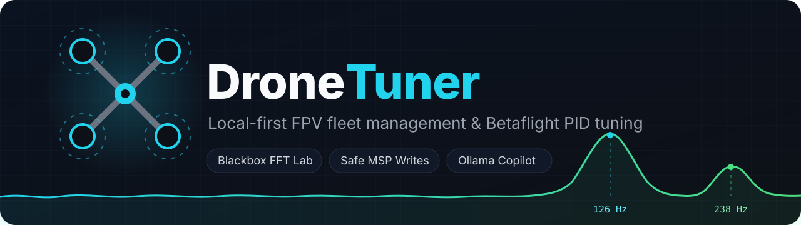
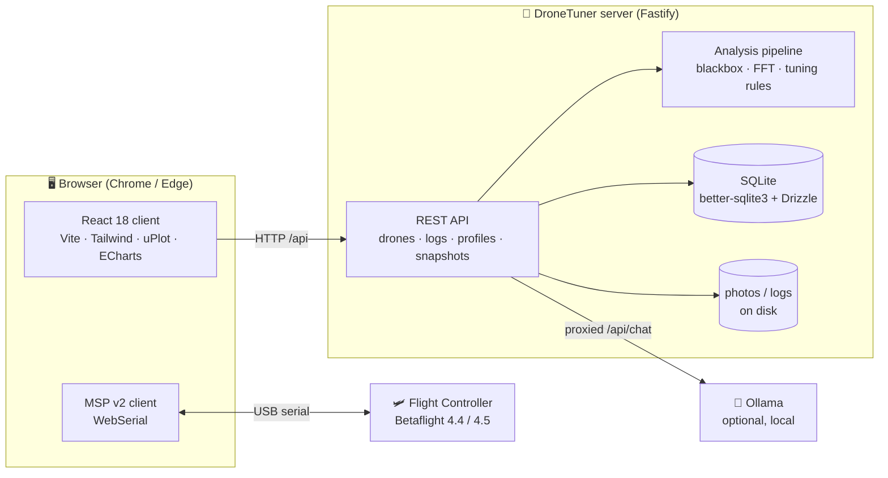

<div align="center">
  

  <br />

  [](LICENSE)
  [](https://nodejs.org)
  [](https://pnpm.io)
  [](https://www.typescriptlang.org)
  [](https://react.dev)
  [](https://fastify.dev)
  [](https://sqlite.org)
  [](https://betaflight.com)
  [](#run-with-docker)

  **Local-first FPV drone fleet manager and Betaflight PID tuning companion.**<br />
  Your fleet, your logs, your tunes — everything stays on your machine.
</div>

---

## 📋 Table of contents

- [Features](#-features)
- [Architecture](#-architecture)
- [Quickstart](#-quickstart)
  - [Run with Docker](#run-with-docker-recommended)
  - [Run from source](#run-from-source-development)
- [Configuration](#%EF%B8%8F-configuration)
- [Connecting a flight controller](#-connecting-a-flight-controller)
- [AI copilot (Ollama)](#-ai-copilot-ollama)
- [Safety model](#-safety-model)
- [Scripts](#-scripts)
- [Tech stack](#-tech-stack)
- [FAQ](#-faq)
- [License](#-license)

## ✨ Features

| | |
|---|---|
| 🛸 **Fleet management** | Track every quad: BOM/component library, photos, flights, battery stats, per-drone notes. FC auto-detect matches a connected board to the right drone by UID, craft name, target, and board. |
| 🔌 **Browser-native FC link** | Talks MSP v2 to your flight controller over WebSerial — no drivers, no desktop app, no cloud. The backend never touches a serial port. |
| 📊 **Blackbox log lab** | A flash download becomes one entry per flight. Per-axis gyro traces, FFT noise spectra, noise classification that tests every line against the motors' own eRPM harmonics (aliases at the log rate included) before calling anything a frame resonance, a `motor_poles` sanity check, PIDtoolbox-style step response by system identification, filter group-delay estimate and plain-language findings. Compare any two flights with automatic setting diffs and a better/worse verdict. |
| 🧙 **Tuning wizard** | Templates per class and goal (65mm/75mm 1S analog, 75mm HD, 2in HD, 2.5in 2S · precision/freestyle/racing/cinematic) with their sources explained, plus analysis-driven proposals. Nothing is folded into your draft until you tick it, and every recommendation ships with a copyable Betaflight CLI snippet. |
| ⚖️ **A/B in one pack** | Write a *crisp* and a *smooth* version of your draft into two PID profiles, fly A, land and switch to B (stick command or OSD), fly again in the same pack; the Log Lab labels each session "A · Crisp" / "B · Smooth" from its headers and compares them. Only the D-term filter chain differs, so you feel the latency-vs-noise trade-off itself. A second A/B writes two rate profiles (centre sensitivity +30 %) that switch in flight from a 3-position switch. |
| 📚 **Vendor catalogue** | 68 factory configs and community presets (BetaFPV, GEPRC, Happymodel, AOS, Karate, UAV Tech, ELRS rc_link, rates) seeded with source URLs, filterable by size class and video system, usable as per-component baselines. |
| 🎛 **Simple / Advanced** | A sidebar toggle hides parameter tables, per-stage delay maths and CLI details until you want them. Advanced mode also shows every template, profile and draft as Betaflight simplified-slider positions (master fixed at 100) with the terms no slider can reach called out. Dark and light themes; the sidebar collapses to icons on narrow windows. |
| 🔒 **Safe writes** | Every change goes through **snapshot → diff → explicit confirm → apply → EEPROM save**. Any snapshot is a one-click restore point. Writes are gated to Betaflight 4.4 / 4.5 / 2025.12 — anything else is read-only. |
| 🤖 **Local AI copilot** | An Ollama-powered chatbot explains findings and proposes confirmable action cards. It can *propose* — it can never write to the FC by itself. |
| 🏠 **Local-first** | One SQLite file, your uploaded photos and logs on disk, zero external services required. Works fully offline (AI copilot optional). |

## 🏗 Architecture



The parser, FFT/analysis math, and tuning rule engine live in `shared/` as TypeScript source consumed directly by both the browser and the server — one implementation, zero drift.

```
├── client/    # React 18 + TS + Vite + Tailwind, shadcn-style UI kit (dark theme)
├── server/    # Fastify + Drizzle ORM + better-sqlite3, analysis pipeline, Ollama proxy
├── shared/    # blackbox parser, FFT/analysis, tuning rule engine, shared types
└── scripts/   # e2e API smoke script
```

## 🚀 Quickstart

### Run with Docker (recommended)

One container serves the built client and the API together on port **3001**. SQLite, photos, and logs persist in a named volume.

```bash
git clone https://github.com/damran/DroneTuner.git
cd DroneTuner
docker compose up -d --build
```

Then open **http://localhost:3001** in Chrome or Edge.

<details>
<summary>Prefer plain <code>docker run</code>?</summary>

```bash
docker build -t dronetuner .
docker run -d --name dronetuner \
  -p 3001:3001 \
  -v dronetuner-data:/data \
  dronetuner
```

</details>

> [!NOTE]
> Open the app via `http://localhost:3001` — WebSerial (the FC connection) is only available in secure contexts, and `localhost` qualifies. A LAN IP over plain HTTP will load the UI but the Connect button won't work.

### Run from source (development)

**Prerequisites:** Node.js 20+, pnpm 9+, Chrome/Edge for the FC connection.

```bash
pnpm install
pnpm seed     # component library + tuning templates
pnpm dev      # API on :3001, client dev server on :5173
```

Open **http://localhost:5173** in Chrome or Edge.

## ⚙️ Configuration

All settings are environment variables (see `server/.env.example`). With Docker Compose, edit the `environment:` block in `docker-compose.yml`; from source, copy `server/.env.example` to `server/.env`.

| Variable | Default | Description |
|---|---|---|
| `HOST` | `127.0.0.1` (`0.0.0.0` in Docker) | Bind address |
| `PORT` | `3001` | API/UI port |
| `DATA_DIR` | `./data` (`/data` in Docker) | SQLite DB + uploaded photos/logs |
| `CLIENT_ORIGIN` | `http://localhost:5173` | Allowed CORS origin (dev) |
| `CLIENT_DIST` | `../client/dist` | Built client bundle to serve at `/` (production) |
| `OLLAMA_URL` | `http://localhost:11434` | Ollama endpoint for the AI copilot |
| `OLLAMA_MODEL` | `llama3.1` | Model used for chat + tool calling |

**What's in the data volume?** `dronetuner.db` (fleet, profiles, snapshots, flights), `photos/` (drone pictures), `logs/` (uploaded blackbox files). Back up one directory and you've backed up everything.

## 🔌 Connecting a flight controller

1. Use **Chrome or Edge on desktop** (WebSerial is required).
2. Plug the FC in over USB — **props off**, always.
3. Click **Connect** in the app; the FC is identified and matched to a drone in your fleet automatically.
4. Betaflight **4.4 / 4.5 / 2025.12** (MSP API 1.45/1.46/1.47): full read/write with the confirm-gated flow (on 2025.12 the app swaps D and D-min to match the renamed d_max semantics). Other versions: read-only.

## 🤖 AI copilot (Ollama)

Optional. The server proxies `/api/chat` to a local Ollama instance with native tool calling; proposals render as confirmable action cards that go through the same safety flow as everything else.

**Ollama on your host (default):**

```bash
ollama pull llama3.1
```

The Compose file already points `OLLAMA_URL` at `host.docker.internal:11434`, so a containerized DroneTuner can reach it.

**Ollama in Docker too:**

```bash
docker compose --profile ai up -d
docker compose exec ollama ollama pull llama3.1
# then set OLLAMA_URL=http://ollama:11434 on the app service (see docker-compose.yml)
```

No Ollama? Everything else works — the chatbot simply stays offline.

## 🛡 Safety model

> [!WARNING]
> DroneTuner **never arms your quad and never spins motors**. Do all bench work with **props off**.

1. No MSP command that can arm is ever sent.
2. Every write flow: full MSP snapshot (stored as a restore point) → diff of every changed value → **explicit user confirm** → apply → EEPROM save.
3. Any snapshot is restorable from the drone's **Connect → Snapshots** panel — restore shows the same diff and confirm step, and is refused on a firmware variant/API mismatch.
4. The AI copilot proposes action cards only — execution always goes through the same confirm flow.

## 📜 Scripts

| Command | What it does |
|---|---|
| `pnpm dev` | Run server (:3001) and client (:5173) together |
| `pnpm seed` | Seed component library + refresh profile templates |
| `pnpm build` | Build the client bundle |
| `pnpm test` / `pnpm typecheck` / `pnpm lint` | Vitest suites / strict TS checks / ESLint across workspaces (CI runs all three) |
| `pnpm smoke` | e2e API smoke script (server must be running) |
| `pnpm -C server exec tsx src/scripts/import-logs.ts --name "Air65 R" --size 65mm --video analog --dir <folder of .BBL> --dumps <folder of CLI .txt>` | Import a folder of blackbox downloads (one entry per flight) and CLI dumps for a drone |

## 🧰 Tech stack

| Layer | Tech |
|---|---|
| Frontend | React 18, TypeScript, Vite, Tailwind, shadcn-style components, TanStack Query, Zustand |
| Charts | uPlot (high-rate traces), ECharts (summaries) |
| Backend | Fastify 5, Drizzle ORM, better-sqlite3, Zod |
| Shared | Blackbox parser (GPL-3.0 Betaflight port), FFT/spectrogram analysis, tuning rule engine, BF CLI dump parser |
| AI | Ollama `/api/chat` with native tool calling, proxied by the server |
| Infra | pnpm monorepo, multi-stage Dockerfile, Docker Compose |

## ❓ FAQ

**Does anything leave my machine?**
No. The only outbound call is to your local Ollama — and only if you use the chatbot.

**Where is my data?**
`server/data/` from source, or the `dronetuner-data` Docker volume. One folder: SQLite DB + photos + logs.

**Can I use it without a flight controller?**
Yes — fleet management, the log lab, profiles, and the wizard all work offline. The FC link is only needed for live snapshots and applies.

**Betaflight 4.6+?**
Detected and readable; writes stay gated off until the MSP surface is verified.

## 📄 License

GPL-3.0-only. This project ports the GPL-3.0 Betaflight blackbox log parser. See [LICENSE](LICENSE).
